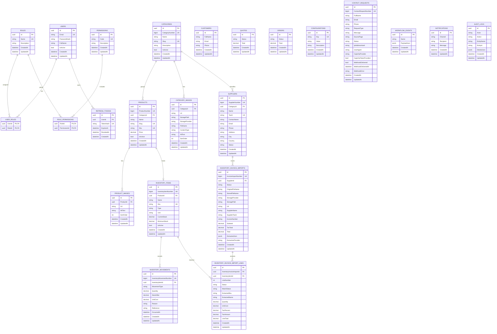

# AMAS API - Diagrama de base de datos

Este documento resume la estructura actual de PostgreSQL para AMAS API y debe actualizarse cuando se agreguen nuevas migraciones.

## Principios

- La llave primaria interna de las entidades principales sigue siendo `Id` tipo `uuid`.
- Los campos visibles para busqueda y operacion son numericos y unicos:
  - `CategoryNumber`
  - `ProductNumber`
  - `InventoryItemNumber`
  - `InventoryMovementNumber`
  - `InvoiceImportNumber`
  - `SupplierNumber`
  - `ContactRequestNumber`
- Las secuencias numericas inician en `1001`.
- PostgreSQL es la fuente principal de datos.
- Redis se usa como cache y no debe ser tratado como fuente de verdad.
- El script idempotente de migraciones para despliegue esta en `deploy/sql/amas_migrations_idempotent.sql`.

## Esquemas

- `identity`: usuarios, roles, permisos y tokens.
- `core`: catalogos, productos, inventario, proveedores, facturas, clientes, cotizaciones, ordenes y configuraciones.
- `automation`: eventos, notificaciones y auditoria.

## Diagrama ER

## Migraciones actuales

| Orden | Migracion | Proposito |
| --- | --- | --- |
| 1 | `20260603033801_InitialCreate` | Estructura base de `identity`, `core` y `automation`. |
| 2 | `20260604000000_AddCategoryImages` | Imagenes asociadas a categorias. |
| 3 | `20260605000000_AddIdentityRolesPermissions` | Roles, permisos y relacion con usuarios. |
| 4 | `20260610171313_AddInventory` | Kardex: items de inventario y movimientos. |
| 5 | `20260611170105_AddInvoiceImports` | Cargue de facturas de inventario. |
| 6 | `20260611191221_AddInvoiceExtractionJson` | JSON extraido de facturas. |
| 7 | `20260611203000_SeedInventoryPermissions` | Permisos de inventario y facturas. |
| 8 | `20260612194106_AddSuppliers` | Administracion de proveedores y relacion con facturas. |
| 9 | `20260616201951_AddVisibleNumbers` | Numeros visibles autoincrementales sin reemplazar los `uuid`. |
| 10 | `20260617201332_AddProductGalleryAndInventoryImage` | Galeria por producto/categoria e imagen identificadora de inventario. |
| 11 | `20260618223140_AddContactRequests` | Solicitudes de contacto publicas con estado de webhook. |

## Uso recomendado en produccion

1. Tomar backup de PostgreSQL antes de aplicar cambios.
2. Probar el script en staging contra una copia reciente.
3. Ejecutar `deploy/sql/amas_migrations_idempotent.sql` en produccion.
4. Validar `/health`, login, productos, proveedores, kardex, cargue de facturas y `POST /api/v1/contact-requests`.
5. No ejecutar scripts locales contra produccion desde `.env` de desarrollo.
